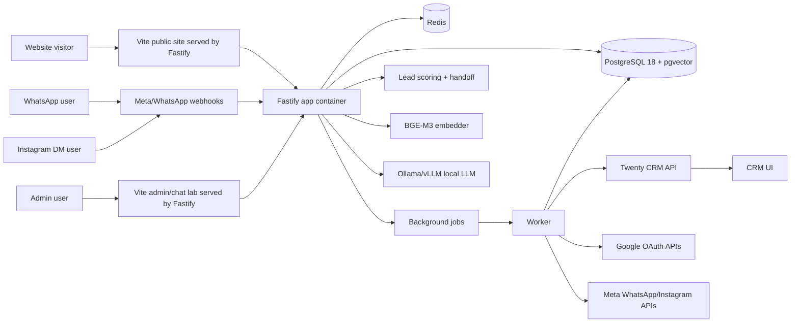

# Technical Requirements Document

## 1. Technical objective

Deliver a production-ready V1 architecture that is powerful enough for high-revenue real-estate businesses but simple enough to operate on one VPS. The architecture should keep business data under the client's control, use Twenty CRM as the only CRM, provide an omni-channel RAG chatbot across website/WhatsApp/Instagram, avoid managed middleware, and support future scaling without rewriting the application.

## 2. Stack snapshot for June 2026

Recommended production baseline:

- Frontend framework: Vite + React 19.2 for the public website, admin CMS UI, chatbot testing/control UI, CRM-lite panels, and analytics dashboards. Vite builds static assets served by Fastify from the `app` container in production; Next.js App Router is not a V1 target unless `17_DECISIONS_LOCK.md` is changed. [S4] [S30]
- Backend API framework: Fastify 5 on Node.js 24 LTS for REST APIs, auth handlers, validation, rate limits, audit writes, integration enqueueing, and static Vite asset serving. Fastify is chosen as the optimized and robust Node-only production default after June 2026 comparison research. [S5] [S6] [S31] [S32]
- Worker runtime: Node.js 24 LTS worker process using BullMQ for background jobs. Production worker uses the same custom app image as `app`, with a different command.
- Language: TypeScript 6.0, with strict mode and migration readiness for TypeScript 7.0. [S17]
- Styling: Tailwind CSS 4.1 and shadcn/ui base-luma components unless brand direction changes. [S18]
- Database: PostgreSQL 18.4 current stable minor in the 18 major line. PostgreSQL 19 is beta and not used for V1 production. [S7] [S8]
- Data access/migrations: Drizzle ORM with `drizzle-orm/node-postgres`, `pg` pooling, and `drizzle-kit generate` for reviewed SQL migrations. Raw SQL is allowed for pgvector, UUID v7 defaults, HNSW indexes, advisory locks, and complex SQL paths. [S35]
- Vector search: pgvector 0.8.3 in the same PostgreSQL instance. [S9] [S10]
- CRM: self-hosted Twenty CRM, v2.x line; use v2.14.0 or newer stable after internal smoke test. [S11] [S12] [S13] [S14]
- Auth: Better Auth with Fastify integration for app auth, sessions, and roles. [S15] [S33]
- Local LLM runtime: Ollama for simple CPU/GPU local inference, vLLM for production GPU inference with OpenAI-compatible server. [S20] [S21]
- Embeddings: BAAI/bge-m3 as default multilingual embedding model. [S19]
- Queue/cache: Redis + BullMQ because Redis is already required/expected for Twenty and background processing.
- Maps: MapLibre GL JS renderer with configurable paid/self-hosted OSM-derived tile/geocoding provider. Do not use public OSM tile servers or public Nominatim as production dependencies.
- Media processing: Fastify multipart uploads, ClamAV scanning, Sharp image optimization, local filesystem storage under `/data/uploads`.
- Reverse proxy: Caddy or Nginx. Caddy is preferred for simpler HTTPS automation; Nginx is acceptable if the team already operates it.
- Deployment: Docker Compose on a single VPS.

## 3. Service topology

V1 services on one VPS:

- `app`: one custom app image running Fastify. Serves `/api/v1/*`, auth handlers, public/admin mutations, rate limits, validation, audit writes, job enqueueing, and built Vite static assets for public website, admin CMS UI, and chatbot UI.
- `worker`: same custom app image, different command. Runs Node/BullMQ background jobs for RAG ingestion, channel webhooks/actions, CRM sync, lead scoring refresh, email, calendar, social publishing, AI media processing, analytics aggregation, uploads, backups, and retries.
- `postgres`: primary PostgreSQL instance with separate databases/schemas for app and Twenty.
- `redis`: queue/cache/session support and Twenty dependency.
- `twenty-server`: Twenty CRM backend.
- `twenty-worker`: Twenty background worker.
- `twenty-web`: Twenty UI if separated by official compose setup.
- `rag-embedder`: local embedding service using BGE-M3.
- `llm-server`: optional local Ollama or vLLM endpoint.
- `clamav`: malware scanning sidecar for uploaded files.
- `reverse-proxy`: Caddy/Nginx for TLS and routing.
- `backup`: cron/container jobs for pg_dump, upload directory archive, and backup verification.
- `monitor`: lightweight local uptime/log monitor if resources allow.

## 4. Routing map

- `https://clientdomain.com/` -> public website.
- `https://clientdomain.com/admin` -> Vite admin CMS route.
- `https://crm.clientdomain.com/` -> Twenty CRM.
- `https://clientdomain.com/api/*` -> Fastify routes inside the `app` container.
- `https://clientdomain.com/api/v1/chat/*` -> website chatbot API endpoints.
- `https://clientdomain.com/chat` or embedded widget route -> Vite chatbot UI.
- `https://clientdomain.com/admin/chat-lab` -> admin chatbot test/QA UI.
- `https://clientdomain.com/api/v1/webhooks/meta/*` -> server-side WhatsApp/Instagram webhook endpoints exposed through Fastify with verification.
- Internal-only services: Postgres, Redis, embedder, LLM, workers.

## 5. Data ownership boundaries

### App database owns

- Website CMS content.
- Property/project records for public website.
- Media metadata, upload scan status, optimized variants, and local file paths.
- Draft/staged/published versions.
- RAG documents, chunks, embeddings, source references.
- Omni-channel chat sessions, channel messages, webhook event IDs, source IDs, action traces, and human handoff state.
- Lead capture staging/outbox.
- Lead score, qualification reason, urgency, and recommended human action.
- CRM sync state, Twenty record IDs, and deep-link references.
- Scheduler bookings.
- Analytics events.
- Integration tokens and sync cursors.
- Audit logs.

### Twenty CRM owns

- People.
- Companies.
- Opportunities/deals.
- Tasks.
- Notes.
- Sales pipeline stages.
- Sales team activity.
- CRM custom objects agreed for V1.

Rule: Twenty CRM database is source of truth for CRM records after sync. App database keeps enough synced metadata for seamless UX, reliability, dashboards, and retry; it is not a second CRM pipeline.

### Google owns

- User mailbox/calendar data accessed only by OAuth scopes approved by the business.
- Calendar events created on behalf of authorized users.
- Gmail messages sent on behalf of authorized users.

### Meta/WhatsApp/Instagram owns

- WhatsApp Business Account, phone numbers, templates, delivery status, and platform messaging limits.
- Instagram professional account, messaging permissions, DM delivery, content publishing state, and platform permissions.
- Social account assets, published post state, and platform permissions.

## 6. Technical architecture diagram

## 7. Runtime requirements

Minimum V1 app-only VPS:

- 8 vCPU.
- 32 GB RAM.
- 300 GB NVMe SSD.
- Ubuntu 24.04 LTS or newer stable server image.
- Docker Engine and Docker Compose.
- Daily VPS snapshots with 7-14 day retention.

Recommended high-revenue local-AI VPS:

- 12-16 vCPU.
- 64-128 GB RAM.
- 500 GB-1 TB NVMe SSD.
- NVIDIA GPU with at least 24 GB VRAM if local LLM latency matters.
- Same single-VPS service design.

Important note: local LLM on CPU-only VPS can work for demos or low concurrency but may not feel production-grade for high-intent sales chat. For strict no-third-party AI, a GPU VPS is the cleanest production path.

## 8. API standards

- REST endpoints under `/api/v1` for public/admin app operations.
- Fastify route schemas must validate params, query, body, and response shapes, and stay aligned with `api_contracts.openapi.yaml`.
- Internal service endpoints under `/internal/*` are blocked at reverse proxy and never exposed to the browser.
- JSON request/response only except explicit upload endpoints.
- Upload endpoints stream through Fastify multipart, enforce size limits before final storage, validate magic bytes, scan with ClamAV, and write metadata only after clean verdict.
- Validation through shared TypeScript schemas and Fastify-compatible JSON schema at the API boundary.
- Every mutating request carries user ID, tenant ID, idempotency key where applicable, and audit metadata.
- Public form APIs have rate limits and bot checks.
- CRM/social/calendar/email operations use outbox pattern, not synchronous blocking.

## 9. Background job requirements

Jobs:

- `cms.publish.index`: ingest published content into RAG.
- `channel.webhook.process`: normalize WhatsApp/Instagram/web channel events into the EGI conversation pipeline.
- `chat.respond`: retrieve approved context, generate/validate response, and enqueue channel reply/action.
- `lead.score.update`: calculate or refresh lead score and handoff recommendation.
- `lead.sync.twenty`: create/update CRM record.
- `booking.sync.calendar`: create/update Google Calendar event.
- `email.send.gmail`: send booking/lead emails through Gmail API.
- `social.media.process`: AI-assisted image edit/variant generation after approval rules.
- `social.publish.instagram`: publish approved social content.
- `analytics.rollup.daily`: aggregate dashboards.
- `backup.pg.dump`: database backup.
- `backup.files.archive`: uploaded files backup.

Each job must have:

- Idempotency key.
- Retry policy.
- Dead-letter state.
- Human-readable error message.
- Admin retry action.

## 10. Security requirements

- HTTPS only.
- Secure cookies, HTTPOnly, SameSite=Lax/Strict where appropriate.
- CSRF protection for browser mutations.
- Role-based access control.
- Tenant isolation even if V1 is single-tenant.
- No secrets in Git.
- OAuth tokens encrypted at rest.
- Uploaded files scanned before publish and public exposure.
- PII masking in logs.
- Audit trail for content, lead, booking, and integration changes.
- Prompt injection mitigation for chatbot and retrieval pipeline, aligned with OWASP GenAI guidance. [S28] [S29]
- Webhook verification for WhatsApp/Instagram channel events.
- No unofficial WhatsApp/Instagram scraping, personal-account automation, or browser-bot messaging.

## 11. Reliability requirements

- App must continue to capture leads if Twenty is temporarily unavailable.
- Website must continue to serve public pages if AI service or channel APIs are unavailable.
- Scheduler must not double-book if worker is delayed.
- Social publishing failure must not delete drafts.
- RAG index must only update after CMS publish, not on draft save.
- Backups must be verified by restore test.

## 12. Observability requirements

- Structured logs per service.
- Request ID propagated across app, worker, and CRM sync.
- Error dashboard for failed jobs.
- Health checks for app, worker, Postgres, Redis, Twenty, embedder, LLM, and ClamAV.
- Daily backup success/failure notifications inside admin dashboard.
- Basic metrics: latency, error rate, queue depth, disk usage, memory, CPU, database size.

## 13. Deployment requirements

- Build one custom app image through CI or controlled local build; run it as `app` and `worker` with different commands.
- Deploy with Docker Compose on VPS.
- Use blue/green-like release via versioned images where possible.
- Run migrations before switching traffic.
- Keep rollback image available.
- Before production release, run smoke tests for website, admin, CRM sync, booking, chatbot, lead scoring, and any enabled WhatsApp/Instagram channels.

## 14. Upgrade strategy

- Use Node 24 LTS until Node 26 enters LTS and application dependencies certify compatibility.
- Stay on PostgreSQL 18 current minor; do not use PostgreSQL 19 beta in production.
- Keep Vite, React, Fastify, and Better Auth on stable releases only; avoid canary/beta dependencies in production.
- Twenty upgrades must be tested against custom objects, API sync, and OAuth behavior in staging before production.
- pgvector must stay at or above 0.8.3 due the June 2026 fixes relevant to HNSW/Postgres 18.

## 15. Technical acceptance criteria

- Full V1 stack runs from a single Docker Compose deployment.
- Public website, CMS, API, Twenty CRM, worker, Postgres, Redis, and RAG services are healthy after reboot.
- Lead capture succeeds even when Twenty is offline and syncs after Twenty returns.
- RAG answers show source IDs and refuse unsupported claims.
- Enabled channels share the same conversation, scoring, handoff, and CRM sync model.
- Daily backup job completes and restore test is documented.
- Security headers and rate limits are active.
- All environment secrets are outside Git.
