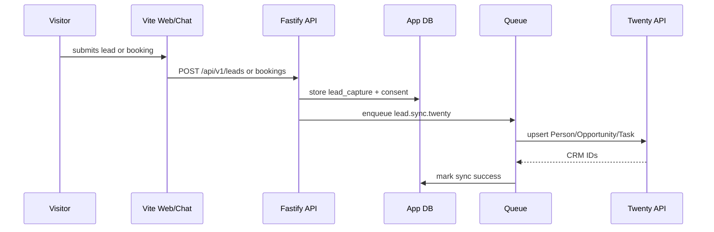
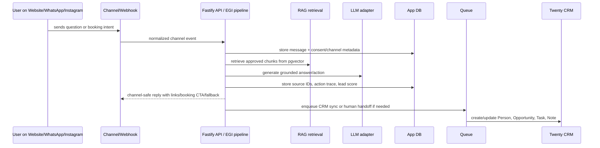
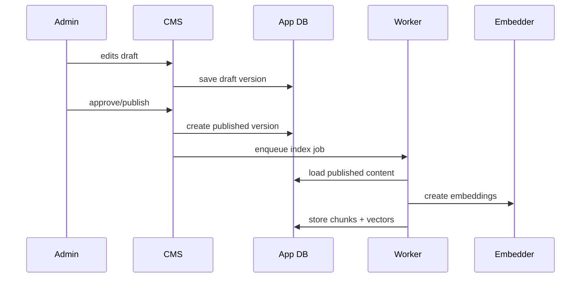
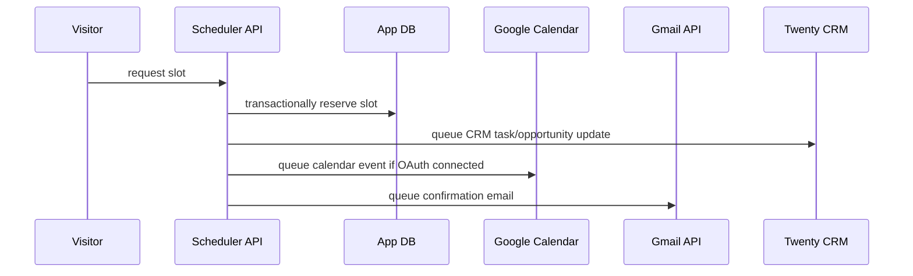

# Architecture Research / Design Document

## 1. Decision summary

The architecture should prioritize controlled ownership, low operational overhead, and business usefulness over complex cloud-native patterns. V1 uses one VPS and Docker Compose. The system is modular inside one deployment so it can later move to multi-node infrastructure without changing the product model.

Current locked runtime split: one custom app image and one worker role. The `app` container runs Fastify, serves `/api/v1/*`, serves Meta/WhatsApp/Instagram webhooks, and serves the built Vite React public site/admin/chatbot assets. The `worker` container uses the same image with a different command for background jobs. Next.js is not a V1 target unless `17_DECISIONS_LOCK.md` is reopened.

### Why this split is better than one giant process or separate frontend/API deploys

- One custom app image keeps VPS deployment simple: build once, run as `app` and `worker`.
- Fastify owns security, validation, audit logs, queues, retries, and static Vite serving in one backend boundary.
- Long-running jobs such as RAG indexing, CRM sync, email, calendar, social publishing, image processing, and backups do not block website/API requests.
- Twenty can be upgraded using its official path instead of maintaining a custom fork.
- Failures are isolated: if Twenty, AI, or social publishing is down, the public site can still serve pages and capture leads.
- Operations stay simple enough for one VPS while still keeping clean service boundaries.

## 2. Why single-VPS V1

Single VPS is chosen because the user explicitly wants to avoid extra third-party services and maintenance headaches. For V1, complexity is the bigger risk than horizontal scale. A real-estate website plus CRM sync plus omni-channel RAG chatbot can run reliably on one strong VPS if the architecture avoids unnecessary managed dependencies.

Benefits:

- Lower monthly cost.
- Better data control.
- Easier backup story.
- Easier client handover.
- Fewer vendors to configure.
- Easier debugging.

Trade-offs:

- VPS provider outage can take down the whole app.
- Local backups on same VPS do not protect against total provider/storage loss.
- Local LLM latency depends heavily on VPS hardware.
- Vertical scaling is the first scaling lever.

Mitigation:

- Daily VPS provider snapshots.
- Local backup verification.
- Documented restore process.
- Optional future offsite backup after business approval.
- Clear resource sizing before enabling heavy local LLM.

## 3. Bounded contexts

### Public website context

Responsible for SEO pages, property discovery, website chatbot widget, lead CTAs, and admin/public UI routes rendered by the Vite React app.

### Omni-channel EGI context

Responsible for normalizing website, WhatsApp, and Instagram DM events into one conversation model; running grounded AI responses/actions; enforcing lead scoring and human handoff; and writing channel-safe replies through official APIs.

### CMS context

Responsible for property/project content lifecycle, staging, approval, publishing, and versioning. UI lives in Vite; mutations and workflow enforcement live in the Fastify API.

### AI/RAG context

Responsible for ingestion, chunking, embeddings, retrieval, answer generation, answer provenance, admin test UI, and evaluation.

### CRM integration context

Responsible for mapping leads/bookings/conversations into Twenty CRM objects and maintaining sync reliability.

### Scheduler context

Responsible for booking rules, availability, booking records, calendar sync, and confirmation/cancellation flows.

### Analytics context

Responsible for event collection, attribution, lead scoring visibility, handoff queue metrics, rollups, dashboards, and business metrics.

### Compliance/audit context

Responsible for RERA metadata checks, consent records, audit logs, retention, export/delete requests, and admin accountability.

## 4. Deployment model

V1 deployment is single-tenant per business. Each customer gets its own VPS/app instance, one custom app image running as `app` and `worker`, own Twenty workspace/database, own files, own OAuth configuration, and own domain.

This is better than shared SaaS V1 because real-estate businesses can have sensitive lead data and compliance expectations. It also avoids cross-tenant data leakage risk in early product stages.

The codebase should still include `tenant_id` columns from day one to avoid painful refactors later.

## 5. Database architecture

Use one PostgreSQL server with separate databases:

- `realestate_app`: Fastify API/worker data for CMS, RAG, scheduler, analytics, auth, integration outbox, and audit logs.
- `twenty`: Twenty CRM database as required by Twenty deployment.

Do not modify Twenty database tables directly. Interact with Twenty through official/generated APIs, because Twenty owns its schema and migrations. Twenty generates REST and GraphQL APIs from workspace schemas, which supports custom objects and metadata-driven integration. [S13]

For seamless interaction, the app stores CRM sync state, Twenty record IDs, deep-link URLs, lead score, channel source, handoff reason, and user-facing CRM status in the app database. Twenty remains source of truth for CRM records after sync; the app database remains source of truth for website/CMS/bookings/omni-channel chat/RAG/uploads/audit.

## 6. Data flow: lead capture

Failure strategy:

- Store first, sync second.
- Use outbox table.
- Retry transient failures.
- Show admin warning for dead-letter records.

## 7. Data flow: omni-channel chat and lead handoff

Important rule: each channel shares the same RAG, scoring, consent, booking, and CRM sync rules. Channel-specific code only handles webhooks, identity, formatting, and delivery.

## 8. Data flow: content publishing to RAG

Important rule: draft content is never embedded into the live chatbot index.

## 9. Data flow: scheduler

The slot reservation must be transactional in PostgreSQL to avoid double booking.

## 10. Why PostgreSQL + pgvector instead of separate vector DB

Using PostgreSQL + pgvector keeps structured property data, permissions, tenant filters, RAG documents, vectors, conversation metadata, channel action traces, and lead scoring features in one transactional system. This reduces sync bugs and avoids another service like Pinecone or Qdrant for V1. pgvector is actively maintained and has June 2026 fixes for Postgres 18/HNSW. [S9] [S10]

A separate vector DB can be revisited if:

- Vector count grows beyond comfortable Postgres operational limits.
- Retrieval latency becomes a blocker under concurrency.
- Multiple tenants are moved into shared SaaS infrastructure.

## 11. Why custom CMS instead of headless CMS

A custom CMS inside the app is preferred for V1 because:

- It avoids another runtime service.
- Property fields are domain-specific.
- Staging/publishing/RERA checks need custom workflows.
- RAG indexing must be tightly tied to publish state.
- Admin UI can be optimized for sales/marketing users.

This is not a generic blog CMS; it is a real-estate operating CMS.

## 12. Why Twenty as CRM core

Twenty is self-hostable and designed for CRM customization. Its documentation emphasizes data ownership, compliance, and customization for self-hosting, matching the project constraints. [S11]

Twenty is not treated as a side integration. It is the CRM core, but it remains upstream self-hosted Twenty, not a fork. The app should avoid duplicating CRM pipeline logic except for local staging/outbox records needed for reliability. The custom web app links/deep-links to Twenty for full CRM work instead of embedding or reimplementing the Twenty UI.

## 13. Integration philosophy

Do not use third-party automation middleware in V1. Every integration is a direct adapter:

- `twentyAdapter`: REST/GraphQL for CRM records.
- `whatsappAdapter`: WhatsApp Business Platform Cloud API and webhooks.
- `instagramMessagingAdapter`: Instagram Messaging/DM webhooks and replies.
- `googleCalendarAdapter`: OAuth calendar events.
- `gmailAdapter`: Gmail API send.
- `metaInstagramAdapter`: Instagram content publishing.
- `llmAdapter`: local Ollama/vLLM OpenAI-compatible interface.

This keeps operations predictable and avoids vendor workflow lock-in.

## 14. Scalability path

### Stage 1: Single VPS

Everything in one Docker Compose project: `app`, `worker`, `postgres`, `redis`, official Twenty services, reverse proxy, backup, ClamAV, and optional local AI services. `app` and `worker` use the same custom app image.

### Stage 2: Bigger VPS

Increase CPU/RAM/disk/GPU. Tune Postgres, Redis, and worker concurrency.

### Stage 3: Split heavy AI

Move LLM inference to a separate GPU server only if business approves extra infrastructure.

### Stage 4: Managed/offsite backups

Add approved offsite backup target if disaster-recovery risk becomes unacceptable.

### Stage 5: Multi-tenant SaaS

Move to multi-node deployment, tenant isolation hardening, centralized observability, and per-tenant billing.

## 15. Architecture acceptance criteria

- All V1 services can start through Docker Compose.
- Custom app image contains both the Fastify server and built Vite assets for production.
- App can run with local AI disabled and still capture leads.
- Twenty failures do not block lead capture.
- The public website does not directly depend on Twenty page-load latency.
- RAG index is source-versioned.
- Website, WhatsApp, and Instagram channels use one conversation/scoring/handoff model when enabled.
- All integration actions have idempotency and retry.
