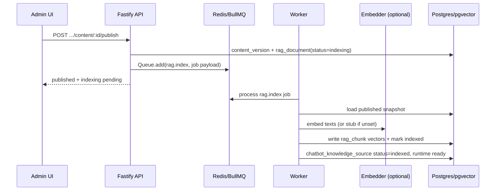

# Plan 005: Real RAG platform pipeline (embeddings + pgvector + async worker)

> **Executor instructions**: Follow this plan step by step. Run every verification command and confirm the expected result before moving to the next step. If anything in the "STOP conditions" section occurs, stop and report — do not improvise. When done, update the status row for this plan in `plans/README.md`.
>
> **Drift check (run first)**: `git diff --stat 1c4365d..HEAD -- packages/db/src/platform.ts packages/db/src/phase1a.ts apps/worker/src/runtime.ts apps/api/src/routes/platform.ts packages/config/src/index.ts packages/core`
> If any in-scope file changed since this plan was written, compare the "Current state" excerpts against the live code before proceeding; on mismatch, treat it as a STOP condition.
>
> **Official docs first (mandatory per segment)**: Before implementing each segment below, web-search and read the linked official docs for that segment. Record any API or version deltas in your commit message or PR notes. Do not rely on training-data memory alone.

## Status

- **Execution status**: DONE (2026-06-23)
- **Priority**: P1
- **Effort**: L
- **Risk**: MED
- **Depends on**: none (plans 001–004 are UI-only; this is the first backend RAG epic)
- **Category**: direction
- **Planned at**: commit `1c4365d`, 2026-06-23
- **Epic**: A — Real RAG (RD alignment: `Real Estate Web RD/04_AI_RAG_RD.md`, `17_DECISIONS_LOCK.md` D3/D4a)

## Why this matters

The production Content desk and widget already call platform routes, but RAG is still a stub: `publishContent` writes `stub/hash-v1` embeddings synchronously in the API process, and `testMessage` / widget retrieval use keyword overlap (`searchChunks`) instead of pgvector cosine search. The worker `rag.index` queue still targets Phase 1A `reindexContent`, not the platform store the web UI uses.

Until this plan lands, admins cannot get semantically grounded answers in production, publish blocks on embedding latency, and the HNSW index on `rag_chunk.embedding` is unused by the platform retrieval path.

## Locked RD decisions (do not reopen)

From `Real Estate Web RD/17_DECISIONS_LOCK.md` and `04_AI_RAG_RD.md`:

- Dense embeddings: **BAAI/bge-m3**, **1024 dimensions**, stored in `vector(1024)`.
- Vector index: **HNSW** with **`vector_cosine_ops`** (already created in migration `0001_known_umar.sql`).
- Heavy indexing runs in the **worker** via BullMQ; public/admin test requests must not synchronously depend on embedder availability.
- Raw SQL is allowed for pgvector operators and filtered retrieval queries.

## Official reference docs (by segment)

| Segment | Topic | Official source (web-search before coding) |
|---|---|---|
| A | BGE-M3 model specs (1024-dim, 8192 tokens) | [Hugging Face — BAAI/bge-m3](https://huggingface.co/BAAI/bge-m3) |
| A | FlagEmbedding usage / dense `encode()` | [FlagEmbedding GitHub — BGE_M3](https://github.com/FlagOpen/FlagEmbedding/tree/master/FlagEmbedding/BGE_M3) |
| B | pgvector cosine distance operator `<=>` | [pgvector README — Querying / Distances](https://github.com/pgvector/pgvector#querying) |
| B | HNSW index with `vector_cosine_ops` | [pgvector README — HNSW](https://github.com/pgvector/pgvector#hnsw) |
| B | Filtered ANN + iterative scan (tenant/chatbot filters) | [pgvector README — Filtering / Iterative Index Scans](https://github.com/pgvector/pgvector#filtering) |
| C | Drizzle `cosineDistance`, HNSW index declaration | [Drizzle — Vector similarity search with pgvector](https://orm.drizzle.team/docs/guides/vector-similarity-search) |
| D | BullMQ `Queue.add` enqueue pattern | [BullMQ — Queues](https://docs.bullmq.io/guide/queues.md) |
| D | BullMQ `Worker` processor + `autorun` | [BullMQ — Workers](https://docs.bullmq.io/guide/workers.md) |
| D | Job retry/backoff for embedder outages | [BullMQ — Retrying failing jobs](https://docs.bullmq.io/guide/retrying-failing-jobs.md) |
| E | Platform async enqueue (no sync embedder in API) | `Real Estate Web RD/09_DATA_MODEL_API_RD.md` § API boundary |
| F | Embedder sidecar contract (future container) | `Real Estate Web RD/docker-compose.skeleton.yml` (`rag-embedder`) |

## Current state

### Platform publish — synchronous stub indexing

`packages/db/src/platform.ts` `publishContent` (Drizzle impl ~868–948) inserts `rag_chunk` rows inline with `embedTextStubHashV1` and `embeddingModel: "stub/hash-v1"` before returning.

### Platform retrieval — keyword overlap, not vectors

```typescript
// packages/db/src/platform.ts:1390-1409
function searchChunks(sourceChunks: ChunkRecord[], query: string, topK: number): PlatformSourceDto[] {
  const terms = queryTokens(query)
  // ... term hit counting, not pgvector ...
}
```

`testMessage` (~1001–1041) loads all chunks for the chatbot, then calls `searchChunks`.

### Phase 1A already has pgvector retrieval (use as exemplar)

```typescript
// packages/db/src/phase1a.ts:688-724 — cosine distance query
c.embedding <=> $2::vector as distance
```

### Worker still uses Phase 1A store

```typescript
// apps/worker/src/runtime.ts:37-49
export function createRagIndexProcessor(store: Phase1aStore, logger: WorkerLogger) {
  return async function processRagIndex(job: Job<RagIndexJobData>) {
    const result = await store.reindexContent(job.data.contentItemId)
```

### Schema / index

- `packages/db/src/schema.ts`: `rag_chunk.embedding` is `vector(1024)`.
- Migration `packages/db/migrations/0001_known_umar.sql` already has:
  `CREATE INDEX "rag_chunk_embedding_hnsw_idx" ON "rag_chunk" USING hnsw ("embedding" vector_cosine_ops);`
- Drizzle schema file does **not** declare the HNSW index (OK — do not regenerate migration unless intentionally reconciling schema drift).

### Config

`packages/config/src/index.ts` already exposes `EMBEDDING_MODEL` (default `BAAI/bge-m3`) and `EMBEDDER_VERSION`, but **no `EMBEDDER_URL`** yet. No embedder service is wired in `docker-compose.phase0.yml`.

## Commands you will need

| Purpose | Command | Expected on success |
|---|---|---|
| Config tests | `pnpm --filter @workspace/config test` | exit 0 |
| DB / core tests | `pnpm --filter @workspace/db test` | exit 0 |
| Worker tests | `pnpm --filter worker test` | exit 0 |
| API tests | `pnpm --filter api test` | exit 0 |
| Typecheck (touched packages) | `pnpm --filter @workspace/core typecheck` (and db, config, api, worker) | exit 0 |
| DB smoke (optional, needs Postgres) | `pnpm smoke:phase1a-db` | exit 0 |

## Scope

**In scope**:

- `packages/core/src/` — new embedding adapter interface + HTTP/stub implementations
- `packages/config/src/index.ts` — `EMBEDDER_URL`, `EMBEDDING_ENABLED` (or equivalent) env parsing
- `packages/db/src/platform.ts` — async publish contract, `indexPlatformContent`, pgvector retrieval
- `packages/db/src/index.ts` — export new types/helpers if needed
- `packages/db/test/` — platform RAG tests (create or extend)
- `apps/worker/src/runtime.ts` — platform-aware `rag.index` processor
- `apps/worker/test/runtime.test.ts` — update processor tests
- `apps/api/src/` — queue client to enqueue `rag.index` on platform publish (new small module)
- `apps/api/src/routes/platform.ts` — wire enqueue after publish (or inside store callback injection)
- `apps/api/test/` — publish → job enqueue assertion (in-memory Redis mock or injected queue)
- `Real Estate Web RD/api_contracts.openapi.yaml` — extend `embeddingModel` enum to include `BAAI/bge-m3` (optional but recommended)
- `scripts/check-openapi.mjs` — only if OpenAPI enum changes require new path checks

**Out of scope**:

- Building the `rag-embedder` Docker image (`ghcr.io/khanect/bge-m3-embedder`) — define HTTP contract only; stub remains default in dev.
- Hybrid sparse+dense retrieval, rerankers, PDF ingestion, chunking v2 metadata fields.
- Phase 1A route/UI changes (`/admin/rag`, `/admin/chat-lab`).
- Web UI changes (`apps/web/**`).
- Better Auth, production deploy, WhatsApp/Instagram connectors.
- Replacing stub embeddings in Phase 1A lab (may share adapter, but not required for DONE).

## Git workflow

- Branch suggestion: `codex/005-real-rag-platform-pipeline`
- Commit message style: conventional commits, e.g. `feat(db): add platform pgvector retrieval and async rag.index worker`
- Do not push or open a PR unless the operator instructs it.

## Target architecture



## Steps

### Segment A — Embedding adapter (`packages/core`)

**Docs**: [BAAI/bge-m3](https://huggingface.co/BAAI/bge-m3) (1024 dims; dense retrieval; no query instruction prefix required).

1. Add `EmbeddingProvider` interface in `packages/core`:

```typescript
export interface EmbeddingProvider {
  readonly model: string
  readonly dimension: number
  embedTexts(texts: string[]): Promise<number[][]>
}
```

2. Add `createStubEmbeddingProvider()` — delegate to existing `embedTextStubHashV1` from `@workspace/db` **or** move the hash function into `packages/core` to avoid circular imports (preferred: keep hash in `phase1a.ts`, re-export from `packages/db`, import in core via `@workspace/db` only if dependency graph stays acyclic; if cyclic, duplicate thin wrapper in core).

3. Add `createHttpEmbeddingProvider({ baseUrl, model, dimension, fetchImpl })` calling a minimal internal contract:

```
POST {EMBEDDER_URL}/v1/embeddings
{ "model": "BAAI/bge-m3", "input": ["text1", "text2"] }
→ { "data": [{ "embedding": number[1024] }, ...] }
```

Align with OpenAI embeddings response shape where practical ([OpenAI embeddings guide](https://platform.openai.com/docs/guides/embeddings)) so the future `rag-embedder` sidecar can be thin.

4. Validate returned vectors: length === 1024, finite numbers; throw `Error` on mismatch (BullMQ requires `Error` throws).

**Verify**: `pnpm --filter @workspace/core test` → exit 0 (add unit tests with mocked `fetch`).

### Segment B — Config (`packages/config`)

**Docs**: repo `loadConfig()` pattern in `packages/config/src/index.ts`.

1. Add env fields:
   - `EMBEDDER_URL` — optional URL (unset = stub-only mode)
   - `EMBEDDING_ENABLED` — boolean, default `true` when `EMBEDDER_URL` set, else `false` (or simpler: stub always available; real embedder when URL present)

2. Expose under `config.ai`: `{ embedderUrl, embeddingModel, embedderVersion, embeddingEnabled }`.

3. Extend `packages/config/test/config.test.ts` for parsing defaults and production enforcement if applicable.

**Verify**: `pnpm --filter @workspace/config test` → exit 0.

### Segment C — Platform store: indexing + pgvector retrieval (`packages/db`)

**Docs**: [pgvector cosine `<=>`](https://github.com/pgvector/pgvector#querying), [Drizzle cosineDistance](https://orm.drizzle.team/docs/guides/vector-similarity-search).

1. Extend `ProductionChatbotStore` with:

```typescript
indexPlatformContent(input: {
  tenantId: string
  chatbotId: string
  contentItemId: string
  sourceVersionId: string
  embed: EmbeddingProvider
}): Promise<{ chunkCount: number } | null>
```

2. **Refactor** Drizzle `publishContent`:
   - Keep: `content_version`, `content_item` status update, `chatbot_knowledge_source` row, `rag_document` row.
   - Change: set `rag_document.status = 'indexing'`, `chatbot_knowledge_source.status = 'indexing'`, `chatbot.runtimeStatus = 'indexing'`.
   - Remove: inline `rag_chunk` inserts and `embedTextStubHashV1` from the publish transaction.
   - Return: `{ item, source, chunkCount: 0, indexing: true }` (extend return type; keep backward-compatible fields).

3. Implement `indexPlatformContent` (Drizzle):
   - Load published snapshot for `sourceVersionId`.
   - `chunkContent(title, body)` (existing helper).
   - `embed.embedTexts(chunks.map(c => c.content))`.
   - Delete prior chunks for same `documentId` / `sourceVersionId` if reindexing.
   - Insert `rag_chunk` rows with `embeddingModel` from provider, `embeddingDimension: 1024`.
   - Update `rag_document`, `chatbot_knowledge_source`, `chatbot` to `indexed` / `ready`.
   - On failure: set `chatbot.runtimeStatus = 'error'`, `lastSyncError` message, rethrow.

4. Replace `searchChunks` usage in Drizzle `testMessage` and `sendWidgetMessage` with SQL modeled on Phase 1A `search()`:

```sql
select c.id, ks.id as knowledge_source_id, d.title, c.content, c.source_version_id,
       c.embedding <=> $queryVector::vector as distance
  from chatbot_knowledge_source ks
  join rag_document d on d.source_version_id = ks.source_version_id
  join rag_chunk c on c.source_version_id = ks.source_version_id
 where ks.tenant_id = $1 and ks.chatbot_id = $2 and ks.status = 'indexed' and d.status = 'indexed'
 order by c.embedding <=> $queryVector::vector
 limit $topK
```

   - Query embedding: use injected `EmbeddingProvider` (stub in tests).
   - Score: `1 - distance` (cosine distance; see pgvector docs).
   - Keep `composePlatformAnswer` and sensitive-query filters unchanged.

5. Update **in-memory** `createInMemoryProductionChatbotStore`:
   - Store chunk embeddings on publish/index path.
   - Implement cosine similarity search in-process (copy math from stub vector dot product / pgvector cosine equivalence).
   - Inject `EmbeddingProvider` via store factory options (default stub).

6. Export `serializePgVector` helper if needed by API/worker tests (already in db package).

**Verify**:

- `pnpm --filter @workspace/db test` → exit 0
- New test: publish → `indexPlatformContent` with stub → `testMessage` returns non-fallback answer for related query.

### Segment D — API enqueue on publish (`apps/api`)

**Docs**: [BullMQ Queues — `add`](https://docs.bullmq.io/guide/queues.md), [Connections](https://docs.bullmq.io/guide/connections.md).

1. Add `apps/api/src/queues/rag-index.ts` (or similar):
   - `createRagIndexQueue(config)` using `Queue` from `bullmq` and `createRedisConnectionOptions` pattern from worker (extract shared connection helper to `packages/core` or duplicate minimally).
   - `enqueuePlatformRagIndex(job: { tenantId, chatbotId, contentItemId, contentVersionId })`.

2. Job options: `{ attempts: 5, backoff: { type: 'exponential', delay: 2000 }, removeOnComplete: 100, removeOnFail: 500 }` per [retry docs](https://docs.bullmq.io/guide/retrying-failing-jobs.md).

3. Extend `RagIndexJobData` in worker to include `chatbotId` (required for platform indexing).

4. Wire platform publish route (`apps/api/src/routes/platform.ts` ~234–238):
   - After successful `publishContent`, enqueue job with ids from result.
   - If Redis unavailable in dev: log warning and leave status `indexing` (document in code comment); tests inject mock queue.

5. Inject queue into `buildApi` for testability (optional factory param).

**Verify**: `pnpm --filter api test` → exit 0; test asserts `Queue.add` called with `rag.index` name and payload containing `chatbotId` + `contentVersionId`.

### Segment E — Worker processor on platform store (`apps/worker`)

**Docs**: [BullMQ Workers](https://docs.bullmq.io/guide/workers.md).

1. Change `startWorkerRuntime` to instantiate `createDrizzleProductionChatbotStore` (not Phase1a) for `rag.index` processing.

2. Replace `createRagIndexProcessor` implementation:

```typescript
// Pseudocode — match repo style
if (job.data.chatbotId && job.data.contentVersionId) {
  await platformStore.indexPlatformContent({ ...job.data, embed: embeddingProvider })
} else if (job.data.contentItemId) {
  // Legacy Phase 1A path — optional deprecation log
  await phase1aStore.reindexContent(job.data.contentItemId)
}
```

3. Build `embeddingProvider` from config: HTTP when `EMBEDDER_URL` set, else stub.

4. On job failure after retries: ensure store leaves `runtimeStatus: 'error'` (handled in Segment C).

**Verify**: `pnpm --filter worker test` → exit 0; update `runtime.test.ts` to use platform store + stub embedder.

### Segment F — OpenAPI + smoke alignment

1. Update `Real Estate Web RD/api_contracts.openapi.yaml` `embeddingModel` enums to include `BAAI/bge-m3` alongside `stub/hash-v1`.

2. Run `pnpm check:openapi` if platform publish response shape changes.

**Verify**: `pnpm check:openapi` → exit 0 (or document skip if checker not yet extended).

### Segment G — End-to-end dev notes (manual, not blocking DONE)

Document in plan completion notes (not necessarily README):

1. Start Redis + Postgres + worker.
2. Publish content from admin UI.
3. Confirm `rag.index` job completes and `testMessage` returns vector-retrieved sources with `score` from cosine similarity.

## Test plan

| Test | Location | Pattern |
|---|---|---|
| Stub embedding dimension 1024 | `packages/core/test/embedding.test.ts` | mirror `apps/api/test/phase1a.test.ts` |
| Config parsing for EMBEDDER_URL | `packages/config/test/config.test.ts` | existing config test style |
| Platform index + vector search | `packages/db/test/platform-rag.test.ts` | in-memory store + stub provider |
| Publish enqueues job | `apps/api/test/platform-rag.test.ts` | inject mock queue |
| Worker processes platform job | `apps/worker/test/runtime.test.ts` | existing processor test |

## STOP conditions

- `packages/db` dependency graph becomes cyclic after moving embedding code — STOP and report; do not duplicate large chunks.
- Postgres integration test shows HNSW index missing on fresh migrate — STOP; run `pnpm db:migrate` and inspect `rag_chunk_embedding_hnsw_idx`.
- Embedder HTTP contract differs from `rag-embedder` skeleton — STOP; propose contract amendment before wiring production URL.
- `publishContent` API response shape break breaks web UI — STOP; extend additively (`indexing: true`) without removing existing fields.
- Any step requires editing `apps/web/**` — STOP; out of scope.

## Done criteria

- [x] Platform `publishContent` returns quickly with `indexing` state; no inline embedding in API handler.
- [x] Worker `rag.index` indexes platform content into `rag_chunk` with real or stub provider (stub in CI).
- [x] `testMessage` and widget path use pgvector cosine query (Drizzle) / cosine in-memory (tests).
- [x] `embedding_model` column records provider model string (`stub/hash-v1` or `BAAI/bge-m3`).
- [x] All package tests listed above pass.
- [x] `plans/README.md` row 005 marked DONE with date.

## Maintenance notes

- When `rag-embedder` container is added to compose, set `EMBEDDER_URL` and verify worker health — no code change if HTTP contract matches Segment A.
- Reindex jobs for content edits: publishing a new version should enqueue a new job; dedupe key is `buildPlatformRagIndexJobId(chatbotId, contentVersionId)` (`__` separator — BullMQ rejects `:` in custom job IDs).
- Phase 1A lab can later call the shared `EmbeddingProvider`; do not delete Phase1a `reindexContent` until lab routes are retired.
- pgvector 0.8+ iterative scan may help tenant-filtered ANN later; not required for V1.